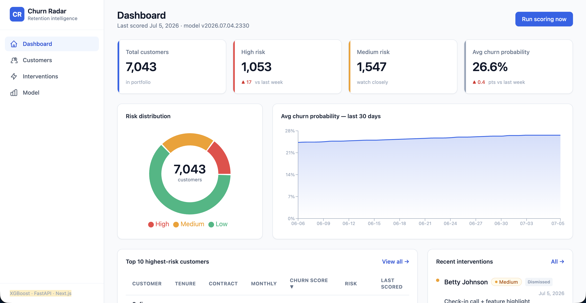
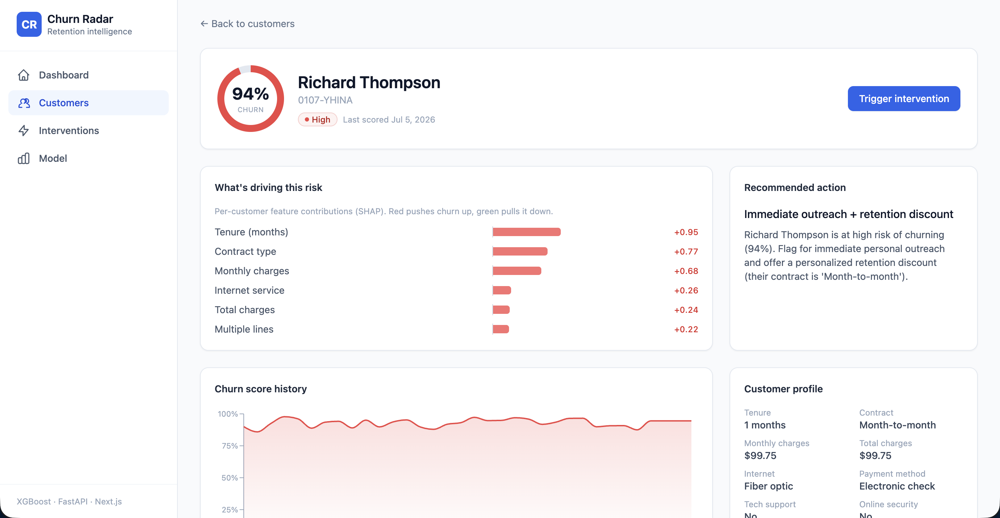
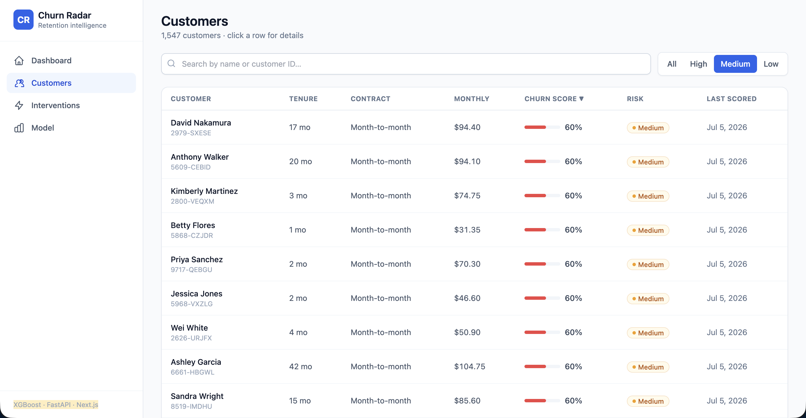
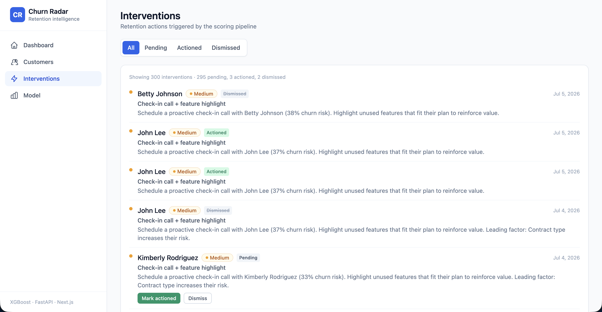
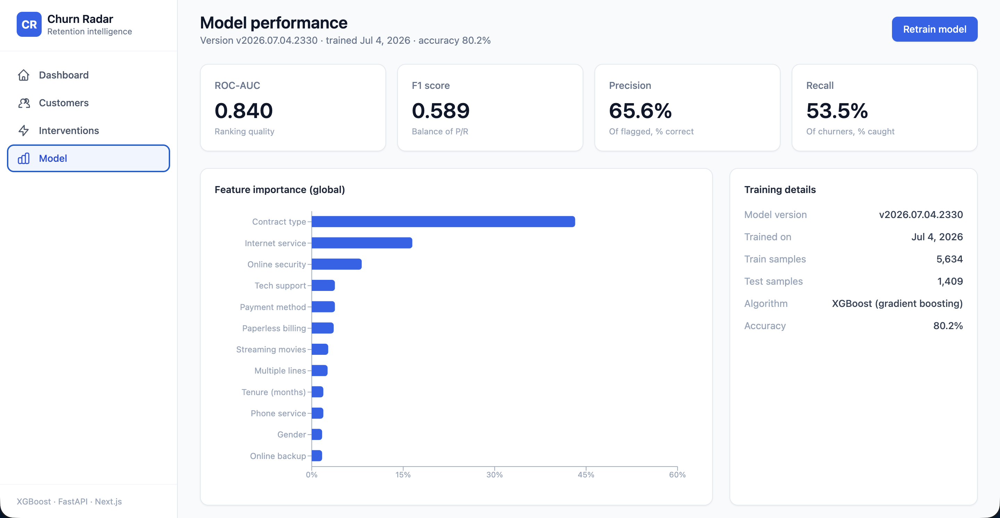

# AI-Powered Customer Churn Prediction Dashboard

An end-to-end churn-prediction platform where an XGBoost model scores every customer each day, uses SHAP to spell out *why* each one is at risk, and feeds a rule-based queue of recommended interventions. It's a real ML system wired together with FastAPI and Next.js — a working pipeline, not a notebook walkthrough.

Trained on the [IBM Telco Customer Churn](https://www.kaggle.com/datasets/blastchar/telco-customer-churn) dataset (7,043 customers), reaching a **ROC-AUC of 0.84**.

## What makes it real

- **An actual model, not a toy** — XGBoost inside a scikit-learn `Pipeline`, measured on ROC-AUC / F1 / precision / recall, version-tracked, and retrainable straight from the UI with one click.
- **Transparent, not a black box** — each prediction carries per-customer SHAP contributions, computed during scoring, ranked, and rewritten in plain language on every customer's page.
- **Hands-off, not manual** — APScheduler re-scores the entire customer base every night at midnight, and a rules engine converts each risk tier into a concrete next action on its own.
- **Fully traceable** — every score and every intervention (pending / actioned / dismissed) is recorded in SQLite, so nothing the dashboard displays is left unexplained later.

---
## Demo
https://github.com/user-attachments/assets/4c453071-048c-4f2c-84b6-2be19e66d7de

## Screenshots

**Dashboard** — portfolio-wide KPIs, risk distribution, a 30-day churn trend, and the top-risk queue


**Customer detail** — a SHAP-backed breakdown of "why this customer is at risk," ranked and explained


**Customers** — a searchable, filterable, sortable table spanning all 7,043 customers


**Interventions** — the action queue a CS team actually works from


**Model performance** — ROC-AUC / F1 / precision / recall, feature importance, and one-click retraining


---

## The pages

| Page | What you'll find |
|------|---------------|
| **Dashboard** (`/`) | KPI cards, a risk-distribution donut, a 30-day churn trend, the ten riskiest customers, and recent interventions |
| **Customers** (`/customers`) | A searchable, filterable, sortable, paginated table of all 7,043 customers |
| **Customer detail** (`/customers/[id]`) | Churn score, per-customer SHAP drivers, score history, a recommendation, and the intervention log |
| **Interventions** (`/interventions`) | Every triggered intervention, filterable by status, with mark-actioned / dismiss controls |
| **Model** (`/model`) | ROC-AUC / F1 / precision / recall, global feature importance, and a retrain button |

---

## How it's wired

```
                          ┌──────────────────────────────────────────┐
                          │            Next.js 14 (App Router)         │
                          │   Dashboard · Customers · Detail · Model   │
                          │           Tailwind CSS + Recharts          │
                          └────────────────────┬───────────────────────┘
                                               │  REST (JSON)
                                               ▼
                          ┌──────────────────────────────────────────┐
                          │                FastAPI                     │
                          │  /dashboard  /customers  /interventions    │
                          │  /model/metrics  /model/retrain  /scoring  │
                          └───────┬───────────────────────┬────────────┘
                                  │                       │
                     ┌────────────▼─────────┐   ┌─────────▼───────────┐
                     │   ML pipeline         │   │   APScheduler        │
                     │  train.py → model.pkl │   │  daily 00:00 scoring │
                     │  score.py (SHAP)      │   └─────────┬───────────┘
                     │  interventions.py     │             │
                     └────────────┬──────────┘             │
                                  │                        │
                          ┌───────▼────────────────────────▼─────────┐
                          │            SQLite  (SQLAlchemy)            │
                          │  customers · interventions ·               │
                          │  score_history · scoring_runs · model_meta │
                          └────────────────────────────────────────────┘
                                  ▲
                     ┌────────────┴───────────┐
                     │  Kaggle API (IBM Telco) │  ← downloaded at setup
                     └────────────────────────┘
```

**Tech stack:** Next.js 14 · Tailwind CSS · Recharts · FastAPI · SQLAlchemy · SQLite · XGBoost · scikit-learn · SHAP · pandas · APScheduler.

### Why it's built this way

- **SHAP runs at scoring time, not on page load.** Explaining a prediction costs more than producing one, so folding that work into the nightly batch keeps every customer page instant instead of doing live inference on each visit.
- **Intervention rules live outside the model.** The mapping from risk tier to recommended action is a small, explicit rules file rather than something learned by the model — a business stakeholder can redefine what "High risk" should trigger without anyone retraining a thing.
- **Training and scoring reuse the same `Pipeline`.** Scaling and one-hot encoding are fit once during training and serialized alongside the model, which removes any chance of train/serve preprocessing drifting apart.
- **Re-scoring won't pile up duplicate interventions.** A customer who already has a pending intervention won't get a fresh one every night — only genuinely new risk produces a new action.

---

## Repo layout

```
backend/
  main.py            FastAPI app + all routes
  scheduler.py       APScheduler daily scoring job (midnight UTC)
  interventions.py   Rule-based intervention engine
  config.py          Env config + risk-tier thresholds
  schemas.py         Pydantic response models
  ml/
    dataset.py       Kaggle download (+ synthetic fallback)
    features.py      Feature definitions / preprocessing
    train.py         Train XGBoost -> model.pkl + metrics
    score.py         Score all customers + per-customer SHAP drivers
    model.pkl        (generated) trained pipeline bundle
  db/
    database.py      Engine / session / Base
    models.py        ORM models
    seed.py          Load Telco data, score, backfill history, seed interventions
  requirements.txt
  .env.example
frontend/
  app/               page.jsx, customers/, customers/[id]/, model/, interventions/
  components/        KPICard, RiskBadge, ChurnChart, CustomerTable, InterventionFeed, Sidebar
  lib/api.js         API client + formatters
  package.json  tailwind.config.js  .env.example
data/                (generated) telco_churn.csv
README.md
```

---

## Getting it running

### What you need
- Python 3.9+ and Node.js 18+
- (Optional) a Kaggle account for the real dataset — without one, a realistic synthetic dataset sharing the exact schema is generated for you.

### 1. Backend

```bash
cd backend
python3 -m venv venv
source venv/bin/activate            # Windows: venv\Scripts\activate
pip install -r requirements.txt

cp .env.example .env                # then fill in your Kaggle credentials (see below)

python -m ml.train                  # download data + train model -> ml/model.pkl
python -m db.seed                   # create churn.db, score 7,043 customers, seed history
uvicorn main:app --reload --port 8020
```

The API now lives at **http://127.0.0.1:8020** (interactive docs at `/docs`).

### 2. Frontend

```bash
cd frontend
npm install
cp .env.example .env.local          # NEXT_PUBLIC_API_BASE=http://127.0.0.1:8020
npm run dev
```

Then open **http://localhost:3000**.

---

## Pulling the dataset through the Kaggle API

1. Generate a Kaggle API token: **kaggle.com → Account → Settings → Create New Token**. That gives you a `kaggle.json` holding your `username` and `key`.
2. Drop the credentials into `backend/.env`:

   ```env
   KAGGLE_USERNAME=your_kaggle_username
   KAGGLE_KEY=your_kaggle_key
   ```
3. `python -m ml.train` (or `python -m ml.dataset --download`) then performs the equivalent of:

   ```bash
   kaggle datasets download -d blastchar/telco-customer-churn
   ```

   and unzips it to `data/telco_churn.csv`.

> **No Kaggle account?** That's fine — when credentials are absent or you're offline, the loader builds a synthetic 7,043-row dataset with the exact Telco schema and believable churn relationships, so the whole app runs without a single external call.

---

## Kicking off scoring and retraining by hand

**From the UI:** the Dashboard has a **"Run scoring now"** button, and the Model page has a **"Retrain model"** button (behind a confirmation modal).

**From the API:**

```bash
# Re-score every customer with the current model (also refreshes interventions)
curl -X POST http://127.0.0.1:8020/api/scoring/run

# Retrain XGBoost on the full dataset, then re-score everyone
curl -X POST http://127.0.0.1:8020/api/model/retrain
```

**From the CLI:**

```bash
cd backend && source venv/bin/activate
python -m ml.train          # retrain -> model.pkl + new model_metadata row
python -m ml.score          # score all customers in the DB
python -m scheduler         # run the daily scoring job once, on demand
```

**Automatically:** while the FastAPI server is up, APScheduler fires the scoring pipeline every day at **00:00 UTC**.

---

## How risk scoring and interventions work

- **Risk tiers:** Low `0–30%`, Medium `30–60%`, High `60–100%` churn probability.
- **Per-customer drivers:** during scoring we precompute each customer's leading churn drivers from XGBoost SHAP contributions and store them on the row — which is what keeps the detail page instant rather than computing on demand.
- **Intervention rules:**
  - **High (>60%)** → flag for immediate outreach and suggest a personalized retention discount.
  - **Medium (30–60%)** → propose a check-in call and surface unused features.
  - **Low (<30%)** → monitor only, no action.
  - Re-scoring never opens a duplicate intervention for the same customer.

---

## API reference

| Method | Endpoint | Description |
|--------|----------|-------------|
| GET | `/api/dashboard/summary` | Totals, risk counts, avg probability, week-over-week trend |
| GET | `/api/dashboard/trend?days=30` | Daily avg churn probability + tier counts |
| GET | `/api/customers` | Paginated list — `tier`, `search`, `sort`, `order`, `page`, `page_size` |
| GET | `/api/customers/{id}` | Detail: features, SHAP drivers, score history, interventions |
| POST | `/api/customers/{id}/interventions` | Manually trigger an intervention |
| GET | `/api/interventions?status=pending` | List interventions, filterable by status |
| PATCH | `/api/interventions/{id}` | Update status (`pending`/`actioned`/`dismissed`) |
| GET | `/api/model/metrics` | ROC-AUC, F1, precision, recall, feature importances |
| POST | `/api/model/retrain` | Retrain + re-score |
| POST | `/api/scoring/run` | Re-score all customers now |

---

## Who uses it, and how

- A **Customer Success Manager** opens the Dashboard each morning, sees the 1,000+ high-risk accounts, and works the **Interventions** queue — calling flagged customers and marking each one *actioned*.
- A **business owner** glances at the 30-day churn trend and the risk-distribution donut to judge whether retention is improving — no code or SQL required.
- An **ops analyst** pulls up a customer's detail page ahead of a renewal call to see exactly *which factors* (month-to-month contract, no tech support, high monthly charges…) are pushing that account's risk, then follows the recommended action.
- A **data owner** retrains the model from the Model page after fresh data arrives and confirms ROC-AUC / precision / recall are still healthy.

---

## Environment variables

**backend/.env**

```env
KAGGLE_USERNAME=your_kaggle_username
KAGGLE_KEY=your_kaggle_key
DATABASE_URL=sqlite:///./churn.db
MODEL_PATH=ml/model.pkl
FRONTEND_ORIGIN=http://localhost:3000
```

**frontend/.env.local**

```env
NEXT_PUBLIC_API_BASE=http://127.0.0.1:8020
```
